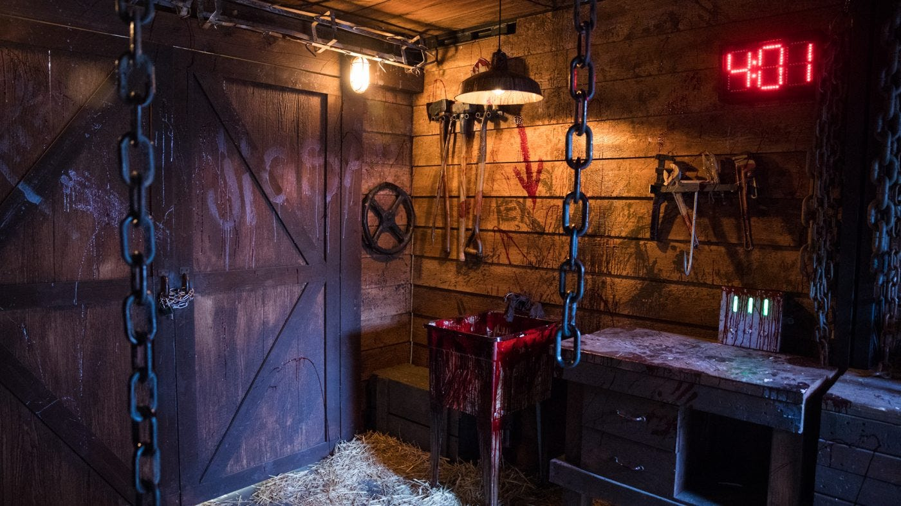

# Escape Games Olomouc



Jednostránkový prodejní web únikových her vytvořený na základě free šablony [Grayscale](https://startbootstrap.com/theme/grayscale).

---

## 🔗 Odkazy

- **Živá ukázka**: [bootstrapbooqito.vercel.app](https://bootstrapbooqito.vercel.app)
- **Šablona Grayscale**: https://startbootstrap.com/theme/grayscale

---

## 🎯 Popis projektu

Tento projekt je jednoduchý responsivní landing page pro provozovatele únikových her v Olomouci.  
Klíčové vlastnosti:

- 🚀 **Jednostránkový web** – všechny sekce na jedné stránce
- 📱 **Responzivita** – správné zobrazení na desktopu, tabletu i mobilu
- 🎨 **Tematické barvy & fonty** – tmavé pozadí, červené akcenty, čitelné fonty
- 🔌 **Booqito rezervace** – integrovaný widget pro online rezervaci
- ⚙️ **Volně dostupná šablona** – upravená Grayscale od Start Bootstrap

---

## 📦 Instalace

1. **Stáhněte nebo naklonujte repozitář**
   ```bash
   git clone https://github.com/uzivatel/escape-games-olomouc.git
   cd escape-games-olomouc
   ```
